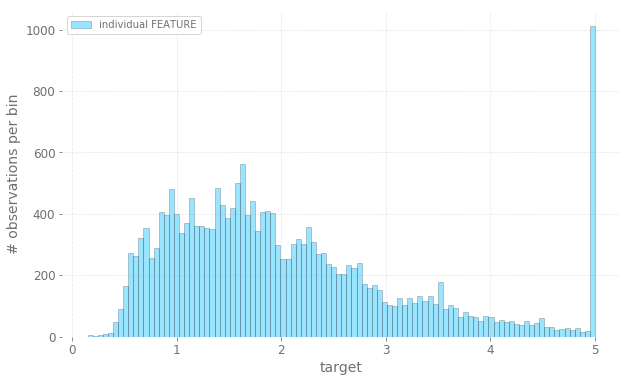
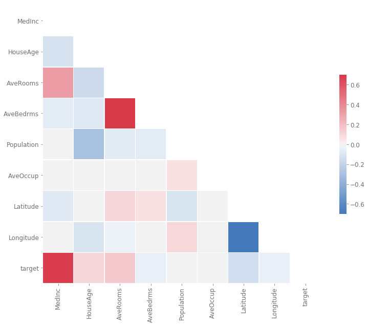
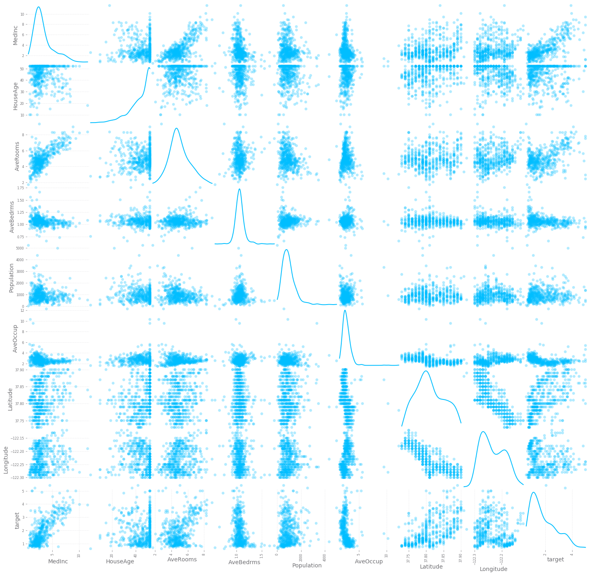
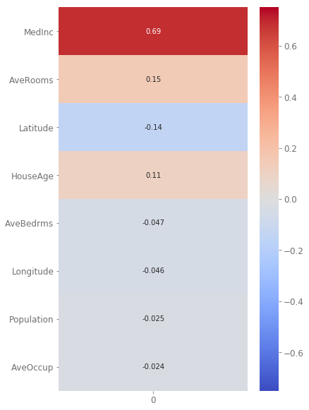
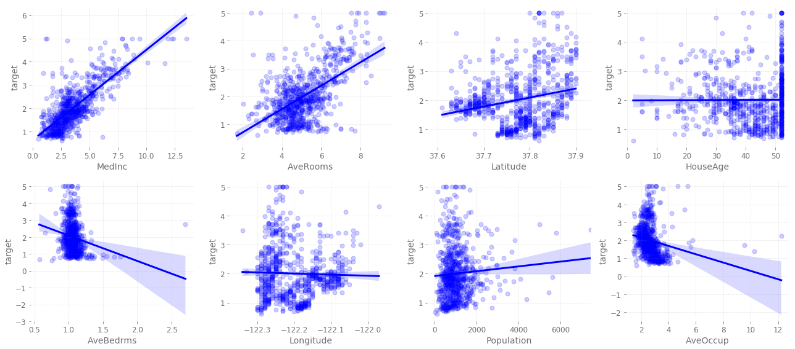
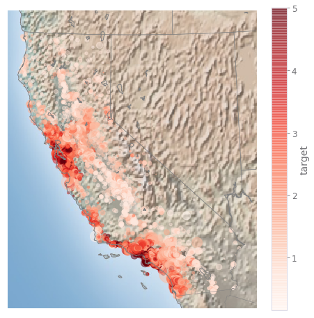
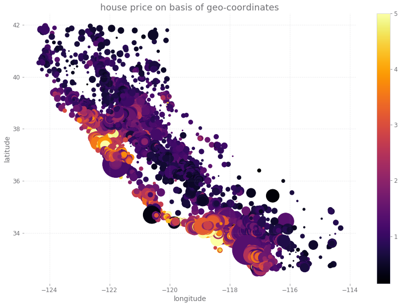
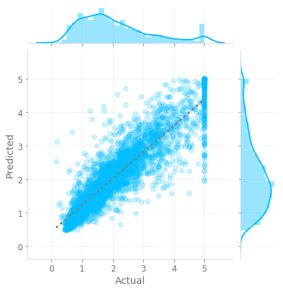
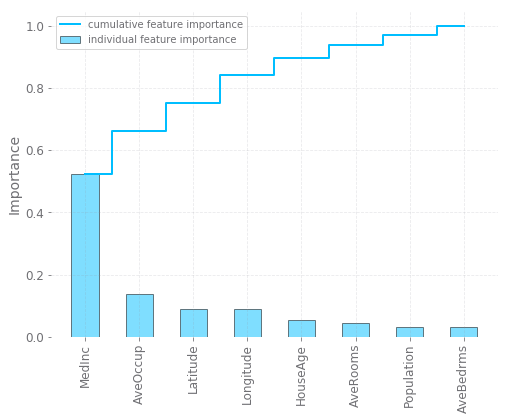

<h1>Table of Contents<span class="tocSkip"></span></h1>
<div class="toc"><ul class="toc-item"><li><span><a href="#EDA" data-toc-modified-id="EDA-1"><span class="toc-item-num">1&nbsp;&nbsp;</span>EDA</a></span></li><li><span><a href="#Model" data-toc-modified-id="Model-2"><span class="toc-item-num">2&nbsp;&nbsp;</span>Model</a></span></li></ul></div>


```python
from sklearn.datasets import fetch_california_housing
import matplotlib.pyplot as plt
plt.style.use('gadfly')
import seaborn as sns
import pandas as pd
from pandas.plotting import scatter_matrix
import numpy as np

from sklearn.ensemble import RandomForestRegressor
from sklearn.model_selection import train_test_split
from sklearn.metrics import mean_squared_error

import os
os.environ["PROJ_LIB"] = "C:\\Users\\ricca\\Anaconda3\\Library\\share"; #fixr
from mpl_toolkits.basemap import Basemap
```


```python
data = fetch_california_housing()

df = pd.DataFrame(data.data, columns=data.feature_names)
df['target'] = data.target
```

# EDA


```python
df.shape
```


    (20640, 9)


```python
def cols_eda(df): 
    eda_df = {}
    eda_df['null_sum'] = df.isnull().sum()
    eda_df['null_%'] = df.isnull().mean()
    eda_df['dtypes'] = df.dtypes
    eda_df['count'] = df.count()
    eda_df['mean'] = df.mean()
    eda_df['median'] = df.median()
    eda_df['min'] = df.min()
    eda_df['max'] = df.max()
    return pd.DataFrame(eda_df)
```


```python
cols_eda(df)
```


<table border="1" class="dataframe">
  <thead>
    <tr style="text-align: right;">
      <th></th>
      <th>count</th>
      <th>dtypes</th>
      <th>max</th>
      <th>mean</th>
      <th>median</th>
      <th>min</th>
      <th>null_%</th>
      <th>null_sum</th>
    </tr>
  </thead>
  <tbody>
    <tr>
      <th>MedInc</th>
      <td>20640</td>
      <td>float64</td>
      <td>15.000100</td>
      <td>3.870671</td>
      <td>3.534800</td>
      <td>0.499900</td>
      <td>0.0</td>
      <td>0</td>
    </tr>
    <tr>
      <th>HouseAge</th>
      <td>20640</td>
      <td>float64</td>
      <td>52.000000</td>
      <td>28.639486</td>
      <td>29.000000</td>
      <td>1.000000</td>
      <td>0.0</td>
      <td>0</td>
    </tr>
    <tr>
      <th>AveRooms</th>
      <td>20640</td>
      <td>float64</td>
      <td>141.909091</td>
      <td>5.429000</td>
      <td>5.229129</td>
      <td>0.846154</td>
      <td>0.0</td>
      <td>0</td>
    </tr>
    <tr>
      <th>AveBedrms</th>
      <td>20640</td>
      <td>float64</td>
      <td>34.066667</td>
      <td>1.096675</td>
      <td>1.048780</td>
      <td>0.333333</td>
      <td>0.0</td>
      <td>0</td>
    </tr>
    <tr>
      <th>Population</th>
      <td>20640</td>
      <td>float64</td>
      <td>35682.000000</td>
      <td>1425.476744</td>
      <td>1166.000000</td>
      <td>3.000000</td>
      <td>0.0</td>
      <td>0</td>
    </tr>
    <tr>
      <th>AveOccup</th>
      <td>20640</td>
      <td>float64</td>
      <td>1243.333333</td>
      <td>3.070655</td>
      <td>2.818116</td>
      <td>0.692308</td>
      <td>0.0</td>
      <td>0</td>
    </tr>
    <tr>
      <th>Latitude</th>
      <td>20640</td>
      <td>float64</td>
      <td>41.950000</td>
      <td>35.631861</td>
      <td>34.260000</td>
      <td>32.540000</td>
      <td>0.0</td>
      <td>0</td>
    </tr>
    <tr>
      <th>Longitude</th>
      <td>20640</td>
      <td>float64</td>
      <td>-114.310000</td>
      <td>-119.569704</td>
      <td>-118.490000</td>
      <td>-124.350000</td>
      <td>0.0</td>
      <td>0</td>
    </tr>
    <tr>
      <th>target</th>
      <td>20640</td>
      <td>float64</td>
      <td>5.000010</td>
      <td>2.068558</td>
      <td>1.797000</td>
      <td>0.149990</td>
      <td>0.0</td>
      <td>0</td>
    </tr>
  </tbody>
</table>
</div>


```python
plt.figure(figsize=(10,6))
sns.distplot(df.target, kde=False, bins=100, hist_kws={'edgecolor':'k', 'linewidth':.5}, label='individual FEATURE')
plt.xlabel('target')
plt.ylabel('# observations per bin')
plt.legend(loc='best');
```





there is an outliar, it might originate from wrong data.


```python
corr = df.corr()
mask = np.triu(np.ones_like(corr, dtype=np.bool)) # mask to have just a triangular matrix
f, ax = plt.subplots(figsize=(13, 10))
cmap = sns.diverging_palette(250, 9, as_cmap=True)
sns.heatmap(corr, mask=mask, cmap=cmap, vmin=-0.7, vmax=0.7, center=0,
            square=True, annot=False, linewidths=.5, cbar_kws={"shrink": .5});
```





```python
#display scatter_matrix also
fig = plt.figure()
scatter_matrix(df[:500], figsize=(25,25), alpha=0.3, diagonal="kde", marker="o");
```


    <Figure size 432x288 with 0 Axes>





```python
correlations = df.corrwith(df['target']).iloc[:-1].to_frame() # you should have features only and label as last column in df
correlations['abs'] = correlations[0].abs()
sorted_correlations = correlations.sort_values('abs', ascending=False)[0]
fig, ax = plt.subplots(figsize=(6,10))
sns.heatmap(sorted_correlations.to_frame(), cmap='coolwarm', annot=True, vmin=-0.75, vmax=0.75, ax=ax);
```





```python
fig, axes = plt.subplots(2, 4, figsize=(18, 8)) # this is for 9 plots
for i, col in enumerate(sorted_correlations.index[:8]):
    sns.regplot(x=col, y='target', data=df[:800], fit_reg=True, color='blue', scatter_kws={'alpha':0.2}, ax=axes[i//4][i%4])
plt.tight_layout()
```





```python
BBox = (df.Longitude.min(), df.Longitude.max(), df.Latitude.min(), df.Latitude.max())
BBox
```


    (-124.35, -114.31, 32.54, 41.95)


```python
# 1. Draw the map background
fig = plt.figure(figsize=(8, 8))
m = Basemap(projection='lcc', resolution='h', 
            lat_0=37.5, lon_0=-119,
            width=1E6, height=1.2E6)
m.shadedrelief()
m.drawcoastlines(color='gray')
m.drawcountries(color='gray')
m.drawstates(color='gray')

# 2. scatter city data, with color reflecting population
# and size reflecting area
m.scatter(df['Longitude'].values, df['Latitude'].values, latlon=True,
          c=df['target'].values, s=df['Population'].values/50,
          cmap='Reds', alpha=0.5)

# 3. create colorbar and legend
plt.colorbar(label='target');
# plt.clim(3, 7)
```





```python
plt.figure(figsize=(15,10))
plt.scatter(df['Longitude'],df['Latitude'],c=df['target'],s=df['Population']/10, cmap='inferno')
plt.colorbar()
plt.xlabel('longitude')
plt.ylabel('latitude')
plt.title('house price on basis of geo-coordinates')
plt.show()
```





# Model


```python
X = df.drop('target', axis=1)
y = df['target']
X_train, X_test, y_train, y_test = train_test_split(X, y, test_size=0.2, random_state=42)
```


```python
forest = RandomForestRegressor(random_state=42)
forest.fit(X_train, y_train)

y_pred = forest.predict(X_test)
print(f'The RMSE is: {np.sqrt(mean_squared_error(y_test,y_pred))}')
print(f'The target mean value is: {np.mean(df.target.values)}')
print(f'Therefore the error is about {np.sqrt(mean_squared_error(y_test,y_pred))*100/np.mean(df.target.values)} %')
print(f'The R2 value is: {forest.score(X_test, y_test)}')
```

    The RMSE is: 0.505760422142145
    The target mean value is: 2.068558169089147
    Therefore the error is about 24.44990088747892 %
    The R2 value is: 0.8047986477101373
    


```python
test_res = pd.DataFrame({'Predicted':y_pred,'Actual':y_test})

sns.jointplot(x='Actual', y='Predicted', data=test_res,
              joint_kws={'scatter_kws':{'alpha':0.2},'line_kws':{'color':'gray', 'linestyle':'dotted'}}, kind="reg");
```





```python
def plot_feature_importance(df, forest, n):
    features = df.columns
    importances = forest.feature_importances_
    indices = np.argsort(importances)[::-1]
    
    fig = plt.figure(figsize=(8,6))
    plt.bar(np.arange(0,n,1), importances[indices[:n]], align='center', width=.5, alpha=.5, linewidth=1.0, edgecolor='k',
           label='individual feature importance')
    plt.step(np.arange(0,n,1), np.cumsum(importances[indices[:n]]), where='mid', label='cumulative feature importance')
    plt.xticks(np.arange(0,n,1), features[indices[:n]], rotation=90)
    plt.ylabel('Importance')
    plt.legend(loc='best')
    
plot_feature_importance(X_train, forest, X_train.shape[1])
```




